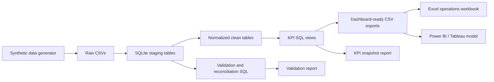

# Reverse Logistics PO & Inventory Removal Control Tower

This project simulates a reverse logistics control tower for returned consumer electronics across North America, Europe, and Asia Pacific. It covers internal sites, 3P partners, purchase orders, inventory movements, truck scheduling, scrap inventory removal, material requests, exception management, KPI reporting, and backlog reduction.

All data is fictional and generated synthetically. The project does not use Amazon branding, internal data, proprietary names, or real operational records.

## Business Problem

Reverse logistics teams often need to coordinate multiple workstreams at once:

- Returned inventory moving between sites, partners, repair hubs, and scrap yards.
- POs requiring approval, accrual, accounting cleanup, or partner follow-up.
- Trucks that can be delayed, canceled, or scheduled before upstream readiness.
- Scrap/removal requests aging beyond partner SLA.
- High-priority material requests that block repairs or backlog reduction.
- Exceptions that need clear owner accountability.

Leadership needs repeatable weekly reporting and ad-hoc analysis to answer: Where is backlog building, which partners or sites are driving delay, what POs need action, and which inventory can be removed to reduce risk?

## Architecture



## Deliverables

| Deliverable | Location |
| --- | --- |
| Synthetic data generator | `src/generate_data.py` |
| SQLite schema and load scripts | `sql/01_create_tables.sql`, `sql/02_load_clean_tables.sql` |
| KPI views | `sql/03_kpi_views.sql` |
| Validation and reconciliation SQL | `sql/04_validation_queries.sql`, `sql/05_reconciliation_queries.sql` |
| Python ETL pipeline | `run_pipeline.py`, `src/database.py`, `src/validate.py`, `src/kpis.py` |
| Raw synthetic CSVs | `data/raw` |
| Clean normalized CSVs | `data/processed` |
| SQLite database | `db/reverse_logistics_control_tower.sqlite` |
| Dashboard exports | `outputs/dashboard_exports` |
| Excel workbook | `outputs/excel/Reverse_Logistics_Control_Tower.xlsx` |
| VBA modules | `vba_modules/ControlTowerOps.bas` |
| SOP and documentation | `docs` |
| KPI and validation reports | `reports` |

## Dataset

The generator creates realistic fictional records with intentional defects for validation and reconciliation practice.

| Dataset | Required | Generated in sample run |
| --- | ---: | ---: |
| Sites | 12+ | 15 |
| Partners | 8+ | 11 |
| SKUs/components | 60+ | 75 |
| Inventory movements | 2,000+ | 2,264 |
| Purchase orders | 500+ | 649 |
| Truck schedules | 800+ | 930 |
| Scrap/removal requests | 700+ | 840 |
| Material requests | 600+ | 720 |
| Exceptions | 300+ | 430 |

Synthetic defects include missing movement links, duplicate IDs, invalid movement references, pickup timing anomalies, overdue removals, closed removals without removed dates, delayed POs, missing actual dates, canceled trucks, and backlog spikes.

## How To Run

From the project root:

```bash
python -m venv .venv
.\.venv\Scripts\activate
pip install -r requirements.txt
python run_pipeline.py
```

Optional run controls:

```bash
python run_pipeline.py --seed 423 --as-of-date 2026-05-22
python run_pipeline.py --skip-generation
```

The pipeline will:

1. Generate raw synthetic CSVs.
2. Create a fresh SQLite database.
3. Load raw files into staging tables.
4. Build clean normalized tables with keys and foreign keys.
5. Run validation checks and reconciliation views.
6. Export dashboard-ready CSVs.
7. Write KPI and validation markdown reports.

## KPI Definitions

| KPI | Definition |
| --- | --- |
| Total open inventory units | Sum of units in movements with Created, Scheduled, In Transit, Delayed, or Exception Hold status. |
| Backlog units by region/site | Open movement units grouped by origin site and region. |
| Average removal aging | Average age in days from removal creation to removed date, or reporting date if still open. |
| Scrap removal SLA breach rate | Percent of non-canceled removals exceeding partner SLA. |
| PO approval cycle time | Average days between PO creation and approval. |
| Open PO count | POs pending/delayed approval or with disputed/accrual-needed accounting status. |
| Truck on-time pickup rate | Percent of trucks with actual pickup at or before scheduled pickup. |
| Truck on-time delivery rate | Percent of trucks with actual delivery at or before scheduled delivery. |
| Material request fulfillment cycle time | Average days between request date and fulfilled date for valid fulfilled requests. |
| High-priority request backlog | Critical or High requests not fulfilled or canceled. |
| Partner SLA performance | Movement and removal SLA performance by partner. |
| Exception count by severity | Open and total exception counts by severity. |
| At-risk inventory value | Estimated value of delayed, exception-held, or aged open inventory. |
| Backlog reduction opportunity | Units in open delayed/aged movements that can be targeted for reduction. |

## Sample Outputs

Sample values from the generated run with `--as-of-date 2026-05-22`:

| Metric | Value |
| --- | ---: |
| Total open inventory units | 134,380 |
| Average removal aging | 45.0 days |
| Scrap removal SLA breach rate | 73.9% |
| Open PO count | 277 |
| Truck on-time pickup rate | 11.9% |
| Truck on-time delivery rate | 10.7% |
| High-priority request backlog | 132 |
| At-risk inventory value | 22,757,237.75 |
| Backlog reduction opportunity | 87,973 units |

Validation summary from the same run:

| Check | Issues |
| --- | ---: |
| PO linked to missing movement | 19 |
| Truck scheduled before PO approval | 94 |
| Actual pickup before scheduled pickup | 64 |
| Removal closed without removed date | 16 |
| Fulfilled material request with zero or missing quantity | 13 |
| Inventory movement with invalid reference | 26 |
| Duplicate PO IDs | 9 |
| Duplicate movement IDs | 14 |
| Overdue removals older than SLA | 364 |

Detailed sample outputs are available in:

- `reports/kpi_snapshot.md`
- `reports/validation_report.md`
- `outputs/dashboard_exports`

## Excel and VBA Workflow

The workbook `outputs/excel/Reverse_Logistics_Control_Tower.xlsx` contains formatted tabs for the exported control tower data:

- Dashboard
- Backlog
- PO Tracker
- PO Status
- Truck Trend
- Removal Aging
- Exceptions
- Requests
- At Risk SKU
- Partner SLA
- DQ Issues

Because macro-enabled workbook creation is environment dependent, this project provides an `.xlsx` workbook plus importable VBA modules.

To enable macros:

1. Open `outputs/excel/Reverse_Logistics_Control_Tower.xlsx`.
2. Save a copy as `Reverse_Logistics_Control_Tower.xlsm`.
3. Press `Alt+F11`.
4. Import `vba_modules/ControlTowerOps.bas`.
5. Run `RefreshAllData`.

Included VBA procedures:

- `RefreshAllData()`
- `GenerateWeeklyOpsSummary()`
- `FlagOverdueRemovals()`
- `ExportLeadershipReport()`
- `FilterByRegion()`
- `CreatePOTrackerView()`

## Dashboard Use

This project uses BI-ready CSV exports rather than a packaged Power BI or Tableau file, so it can be opened in either tool. The dashboard specification is in `docs/DASHBOARD_SPEC.md`.

Recommended dashboard pages:

- Executive Overview
- PO and Partner Performance
- Transportation and Movement Risk
- Scrap Removal and Materials
- Data Quality and Exceptions

Primary export tables:

- `kpi_summary.csv`
- `backlog_by_region_site.csv`
- `po_tracker.csv`
- `truck_delay_trend.csv`
- `removal_aging_distribution.csv`
- `site_exception_table.csv`
- `high_priority_material_requests.csv`
- `at_risk_inventory_by_sku.csv`
- `partner_sla_performance.csv`
- `data_quality_issues.csv`

## Documentation

- `docs/SOP.md`: recurring reporting, ad-hoc PO reporting, overdue removal escalation, and material request triage.
- `docs/PROCESS_FLOW.md`: Mermaid flowchart from material request through KPI reporting.
- `docs/DATA_DICTIONARY.md`: table and field definitions.
- `docs/BUSINESS_REQUIREMENTS.md`: stakeholders, assumptions, success metrics, and limitations.
- `docs/DASHBOARD_SPEC.md`: Power BI/Tableau-ready dashboard design.


