# Process Flow

```mermaid
flowchart LR
    A["Material request created"] --> B["Demand review and priority triage"]
    B --> C{"Existing PO or movement?"}
    C -- "No" --> D["PO creation and approval"]
    C -- "Yes" --> E["Link request to movement or PO"]
    D --> F["Partner or carrier assignment"]
    E --> F
    F --> G["Inventory movement created"]
    G --> H["Truck scheduling"]
    H --> I{"Pickup on time?"}
    I -- "No" --> J["Transportation exception"]
    I -- "Yes" --> K["Site receipt or partner processing"]
    J --> K
    K --> L{"Disposition outcome"}
    L -- "Refurbish or repair" --> M["Return to available inventory"]
    L -- "Recycle or scrap" --> N["Scrap/removal request"]
    N --> O{"Removal within SLA?"}
    O -- "No" --> P["Overdue removal escalation"]
    O -- "Yes" --> Q["Removal closed"]
    M --> R["KPI reporting"]
    P --> R
    Q --> R
    R --> S["Weekly leadership summary"]
```

## Control Points

- PO creation should occur before truck pickup is scheduled.
- Movement references should resolve to valid sites, partners, and SKUs.
- Scrap/removal requests should have approved and removed dates before closure.
- High-priority material requests should be aged daily until fulfilled.
- Exceptions should remain open until an owner confirms closure.

